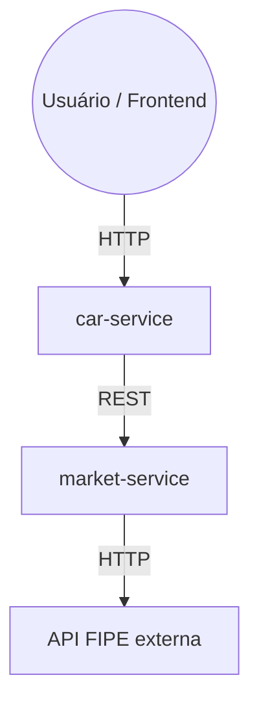

# LasanhaSpec

Plataforma para entusiastas de carros modificados, com foco no mercado brasileiro: garagem digital, catálogo técnico e uma base colaborativa de problemas crônicos por modelo.

**Por que "LasanhaSpec"?** Na cultura gearhead, carros que são modificados são carinhosamente chamados de "lasanhas" , porque, como toda boa lasanha, tem várias camadas (peças) empilhadas, e quem monta se diverte no processo e o  nome pegou.

---

## O problema

O Brasil tem uma frota de veículos cada vez mais envelhecida, puxada pelo custo alto de carro novo desde a pandemia. Isso significa mais gente dependendo de carro usado, com manutenção mais cara e falhas recorrentes que raramente estão documentadas em algum lugar confiável — o conhecimento fica espalhado em fórum, grupo de WhatsApp e vídeo do YouTube, sem estrutura.

O LasanhaSpec tenta centralizar isso: dado técnico real, histórico de problema por modelo, e uma garagem digital pra acompanhar o que muda no seu carro ao longo do tempo.

## Funcionalidades

**Garagem do usuário** — cadastro de veículos com ficha completa (fábrica vs. atual: potência, torque, peso), múltiplas fotos por carro, upload direto pra S3.

**Catálogo técnico** — base de modelos de fábrica, navegável por marca, com ficha de especificação completa.

**Problemas crônicos por modelo** — base colaborativa de falhas conhecidas: sintoma, severidade, custo estimado, manutenção preventiva, com sistema de votos da comunidade. É o diferencial real do projeto.. não existe em nenhum catálogo técnico genérico, só existe porque é feito por quem realmente lida com esses carros.

**Autenticação e controle de acesso** — JWT + Spring Security, com validação de ownership (um usuário só edita/remove o que é dele).

## Arquitetura

O projeto começou como monolito e está migrando pra microsserviços conforme a necessidade "real" aparece. Sem separar cedo demais só porque "é o que se faz"  .

- `car-service` — domínio principal: veículos, garagem, catálogo, crônicos
- `market-service` — dados externos (preço FIPE)



> RabbitMQ já está provisionado no `docker-compose.yml` para comunicação assíncrona entre os serviços (ex: evento de veículo criado), mas ainda não está consumido pelo código — está no roadmap, não implementado.

## Stack

**Backend:** Java 17 · Spring Boot 3 · Spring Data JPA / Hibernate · Spring Security (JWT) · PostgreSQL · Flyway · AWS S3

**Frontend:** React · TypeScript · Vite

**Infra:** Docker Compose · GitHub Actions (CI)

## Rodando localmente

```bash
git clone https://github.com/martinelis25lk/LasanhaSpec.git
cd LasanhaSpec
cp .env.example .env   # preenche as variáveis (banco, JWT secret, credenciais AWS)
docker compose up --build
```
Frontend em `localhost:5173`, `car-service` em `localhost:8080`, `market-service` em `localhost:8081`.

## Status

**Pronto:**
- Autenticação e autorização (JWT + RBAC)
- Garagem do usuário (CRUD completo + galeria de imagens no S3)
- Catálogo de veículos, navegável por marca
- Problemas crônicos com votação
- Suíte de testes (JUnit + Mockito) cobrindo as camadas de serviço e autorização

**Em desenvolvimento:**
- Feed social
- Sistema de badges/conquistas
- Importação de gráfico de dinamômetro (CSV)
- Deploy em produção

## Próximos passos

- Microsserviço de consulta de preço de peças (Mercado Livre / eBay / autopeças nacionais), ligando um crônico aprovado a "quais peças isso envolve e quanto custa hoje"
- Ranking de builds verificado por dado real de dyno, não por número autodeclarado

## Autor

Projeto pessoal, desenvolvido como forma de aprendizado prático em arquitetura de microsserviços e full stack Java/React — em desenvolvimento ativo.
